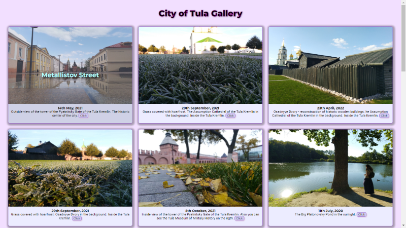

# Grid Gallery with Responsive Screen

#### What has been implemented:

- using grid layout to display images
- gallery has responsive screen width for different device types
- using pseudo selector **`::before`** to display image discription
- images are expanded on click to a larger format (popup-image)
- click here => [_**Grid Image Gallery**_](https://bakna2t.github.io/city_gallery/)

---

